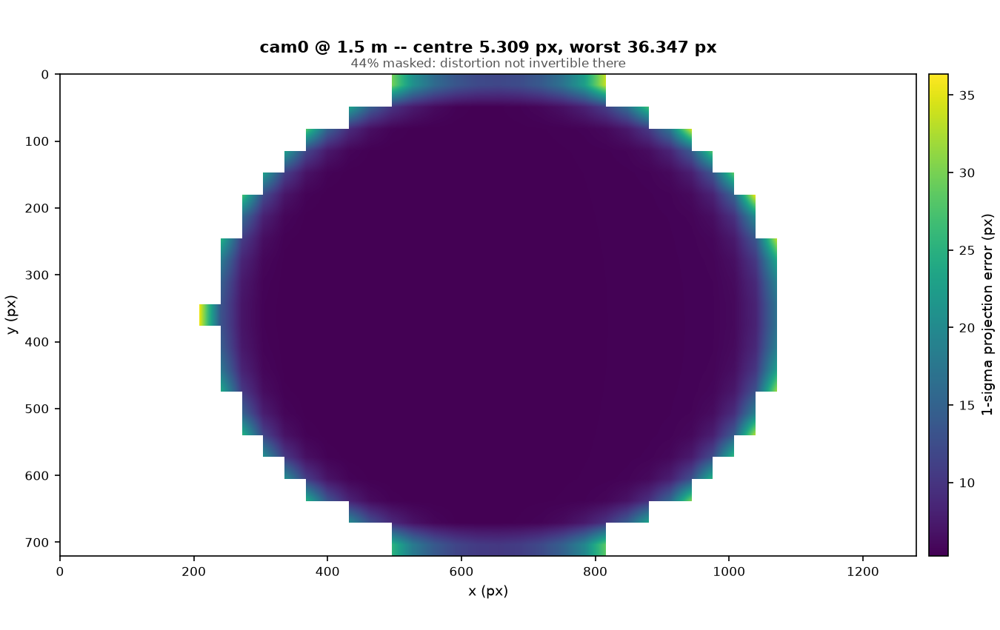
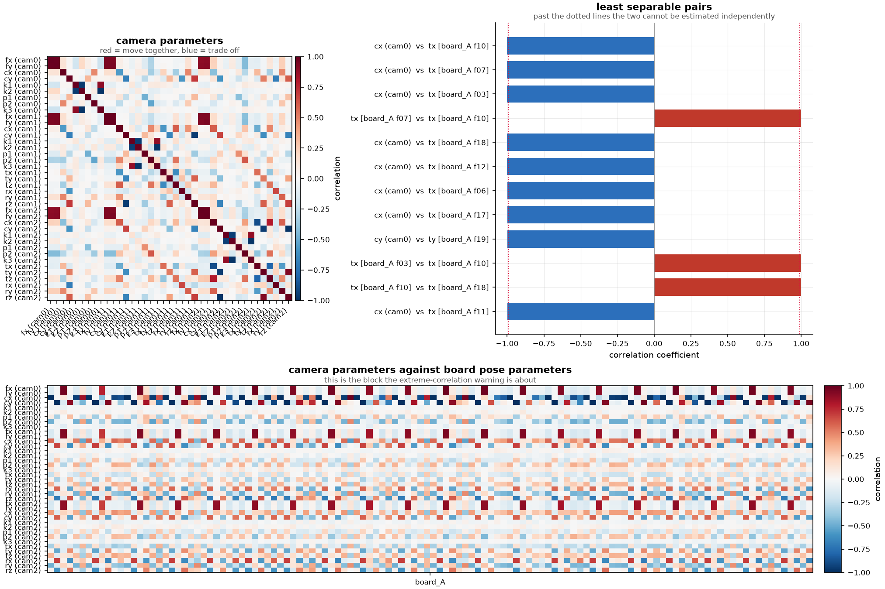

# Multi Object Camera Calibration Tool

[](LICENSE)
[](pyproject.toml)

An open-source multi-camera calibration tool for calibrating **any number of
cameras** against **any number of calibration objects** at the same time.
Charuco board detection, eight camera models, and a desktop GUI.

You can add as many calibration objects as you need and as many cameras as you
like. Boards and cameras are declared in the setup tab, detected, then solved
together in a single bundle adjustment, so every camera pose and every board
pose is estimated in one consistent frame. Alongside the calibration it reports
how much the result can be trusted: parameter covariance, per-pixel projection
uncertainty, residual maps, coverage and cross-validated held-out error.



*A 1-sigma projection uncertainty map from `mlti-cal demo` -- where this
calibration can be trusted, not just its RMS.*

### What it does

- **Multi-camera calibration** for rigs of any size, not just stereo pairs
- **Multi-object calibration**: several targets in one session, with marker ID
  collision checking and refusal of any layout that cannot be told apart
- **Three target types**: Charuco boards, plain checkerboards and dot grids,
  mixable in the same images -- coded boards are detected first and masked out
  before the uncoded detectors search
- **Intrinsic and extrinsic calibration** solved jointly in one optimisation
- **Eight camera models**, including pinhole, fisheye, double sphere and FOV
- **Two solver backends**: scipy and Ceres
- **Uncertainty reporting** instead of a single RMS reprojection error
- **Desktop GUI** built with PySide6, plus a headless command line

## Try it in 30 seconds

No data required -- generates synthetic cameras and boards, calibrates, and
checks the result against known ground truth:

```bash
pip install -e .
mlti-cal demo --cameras 3 --frames 20
```

This is also the fastest way to see whether an install is healthy, and it is
the same code path the GUI runs, so a CLI result and a GUI result never
disagree.

## Requirements

Python 3.12.

## Install

Clone the repository, create a virtual environment and install the
dependencies:

```bash
git clone https://github.com/ibird-bot/multi-object-camera-calibration-tool.git
cd multi-object-camera-calibration-tool

python -m venv .venv
.venv\Scripts\activate            # Windows
# source .venv/bin/activate       # Linux / macOS

pip install -e ".[gui]"
```

The extras decide what you get:

| Command | What it installs |
|---|---|
| `pip install -e .` | Headless core: detection, bootstrap, the scipy solver, the report engine, the CLI. No Qt. |
| `pip install -e ".[gui]"` | The above plus the desktop GUI (PySide6, pyqtgraph, matplotlib). |
| `pip install -e ".[ceres]"` | Adds the Ceres backend. Needs a compiled Ceres, so it is deliberately optional -- without it `mlti-cal backends` lists Ceres as unusable and the scipy backend solves the identical problem. |
| `pip install -e ".[dev]"` | pytest, ruff, mypy, coverage. |

## Running the GUI

With the virtual environment active:

```bash
python -m mlti_cal.gui
```

or, since the package installs an entry point:

```bash
mlti-cal-gui
```

The application opens on the "Setup & Detection" tab, where you declare your
cameras and calibration boards and run detection over their images.
Optimisation and the report follow in their own tabs.

## The report

A low RMS is compatible with a badly wrong calibration, so the report tab
answers "can I trust this?" rather than printing one number. Seven figures,
each also written to disk by **Export...**:

| Figure | What it answers |
|---|---|
| Projection uncertainty | How far a projected point could be wrong at a stated range, per pixel |
| Residual field | Per-corner error arrows; structure here is model inadequacy RMS cannot see |
| Residual map | Per-cell RMS across the sensor, and the per-cell **mean** vector -- averaging cancels random error, so what survives is systematic bias |
| Correlations | Which parameters the data cannot tell apart: the labelled camera block, the worst pairs, and camera parameters against board poses |
| Coverage | Where corners were actually observed, and how varied the board tilts were |
| Residual distribution | Histogram and Q-Q against a normal; heavy tails mean outliers or unmodelled error |
| Error vs radius | Growth toward the edge means the distortion model cannot represent the lens |



*Which parameters the data cannot tell apart -- including camera intrinsics
against board poses, the block a camera-only matrix would hide.*

Two conventions worth knowing:

- **Unobserved regions are masked, never zero.** A sensor cell with no corners
  is drawn grey. Zero would read as a perfect fit in exactly the area the
  calibration knows nothing about.
- **Correlations include board poses.** On a typical capture the strongest
  correlations are a camera parameter against a board pose -- a static board
  makes the principal point indistinguishable from a board translation -- so a
  camera-only matrix would hide the finding. Hover any cell for the exact
  coefficient.

Everything is computed headlessly and stored in `report.json`, so a CLI run and
a GUI run produce identical numbers. Export writes `report.json`,
`report.txt`, `calibration.json`, `calibration.yaml` (OpenCV `FileStorage`) and
one PNG per figure, each rendered at a size chosen for its content rather than
inherited from the window.

## Supported camera models

Eight camera models, each with analytic Jacobians checked against finite
differences.

| Shown as | id | params | For |
|---|---|---|---|
| OpenCV | `pinhole_radtan` | 9 | Normal and wide lenses. Start here. |
| OpenCV Fisheye | `fisheye_kb` | 8 | Kannala-Brandt equidistant fisheye |
| Double Sphere | `double_sphere` | 6 | Fisheye, 2 distortion params, well conditioned |
| Enhanced Unified | `eucm` | 6 | Fisheye and catadioptric, 2 params |
| Thin Prism | `thin_prism` | 16 | Rational radial + tangential + prism |
| Matlab | `matlab` | 10 | OpenCV plus a skew term |
| FOV | `fov` | 5 | One parameter: the lens field of view |
| Halcon Division | `halcon_division` | 5 | One parameter, closed-form inverse |

## Add your own detector

Detectors are a plugin point, not a hardcoded list. Drop a `.py` file in
`~/.mlti_cal/detectors/` (or ship one as a package with an `mlti_cal.detectors`
entry point) and it appears in the GUI's `+ Object` menu next time the app
starts -- nothing in the installed package changes, and a third-party detector
reaches detection through the exact same path the built-ins use. See
[`docs/writing-a-detector.md`](docs/writing-a-detector.md) for the interface
and [`examples/detectors/aruco_grid.py`](examples/detectors/aruco_grid.py) for
a complete, working example.

## Coordinate conventions

Stated explicitly, because getting these wrong is silent:

- Camera frame is OpenCV: +x right, +y down, +z into the scene.
- `T_a_b` maps points from frame `b` into frame `a`.
- `Camera.extrinsic` is `T_cam_rig`; board poses are `T_rig_board`.
- Poses store `[tx,ty,tz, qx,qy,qz,qw]` (scalar **last**).
- The tangent is `[dt(3); phi(3)]`, translation first, with the **decoupled**
  retraction `t <- t + dt`, `q <- q (x) Exp(phi)`.
- The reference camera's extrinsic is fixed at identity. That is the only gauge
  fixed; scale is already metric from the board.

## Tests

```bash
pip install -e ".[dev]"
pytest
```

The end-to-end solves marked `slow` take minutes. To skip them:

```bash
pytest -m "not slow"
```

That is what CI runs on every push; the full suite runs nightly.

## License

MIT. See [LICENSE](LICENSE).
